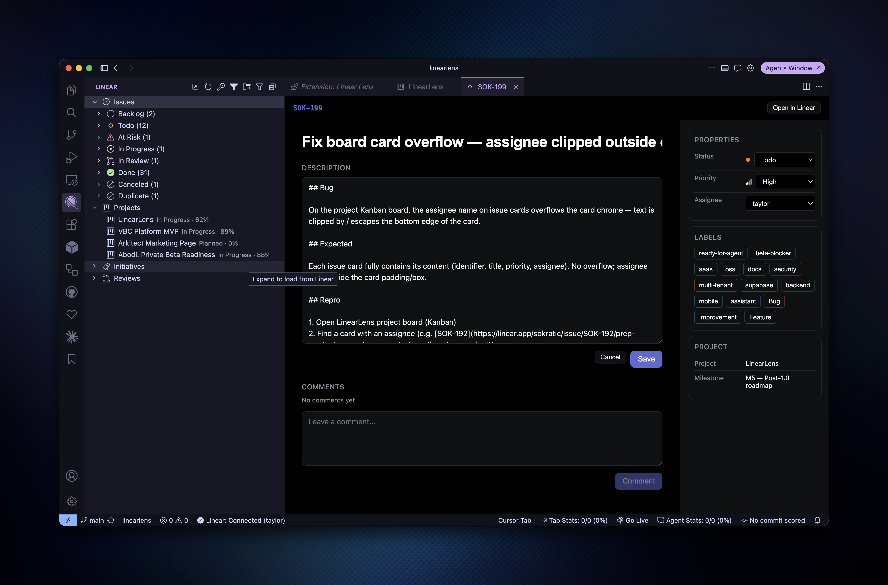
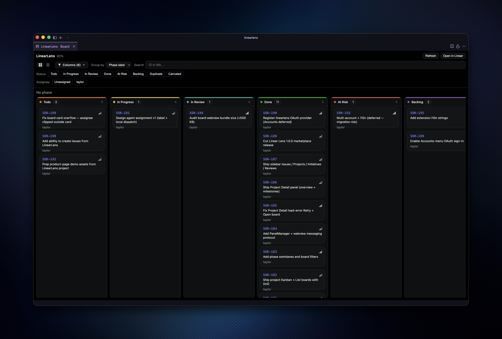

# Linear Lens

[](https://github.com/taylorsegell/linearlens/actions/workflows/ci.yml)

Linear in VS Code and Cursor. Browse Issues, Projects, Initiatives, and Reviews in the sidebar, then open **Issue Detail**, **Project Detail**, and **Kanban/List boards** without leaving the IDE.

Marketplace id: `arkitect.linearlens`



## Features

- **Sidebar**: Issues (filterable), Projects, Initiatives, Reviews
- **Issue Detail**: edit title, description, status, priority, assignee, labels; comment; open sub-issues
- **Project Detail**: overview, milestones, recent issues, editable description
- **Project boards**: Kanban + List, drag-and-drop status, filters, phase swimlanes
- **Auth**: Personal API key for the sidebar and panels (required). OAuth provider id `linearlens` is registered for a future Accounts-menu flow.



## Requirements

- VS Code / Cursor with engine **1.96.0** or later
- A [Linear Personal API key](https://linear.app/settings/account/security) (Settings → Account → Security & Access)

## Getting started

1. Install **Linear Lens** from the marketplace (or a `.vsix`).
2. Open the **Linear** activity bar icon.
3. Run **Linear: Set API Key** and paste your key.
4. Click an issue or project to open panels; use **Linear: Open Project Board** or the project context menu for Kanban/List.

### OAuth (deferred)

Accounts-menu OAuth is not configured for 1.0.0. When added later:

- Provider id: `linearlens`
- Redirects: `vscode://arkitect.linearlens/callback` and `cursor://arkitect.linearlens/callback`
- Requires your own Linear OAuth app + `OAUTH_CLIENT_ID` in `src/oauth/linearOAuth.ts`

Safe to install alongside official `linear.linear-connect`; provider ids differ (`linearlens` vs `linear`).

## Development

**Agent / contributor context:** see [AGENTS.md](./AGENTS.md).

```bash
yarn install
yarn build
```

| Command | Purpose |
|---------|---------|
| `yarn test` | Unit tests |
| `yarn typecheck` | TypeScript check |
| `yarn build` | Extension host + webview |
| `yarn package` | Build installable `.vsix` |

Press **F5** (**Run Extension**) to open an Extension Development Host.

## Publishing

1. Ensure `publisher` is `arkitect`, `name` is `linearlens`, and `version` is bumped.
2. Update [CHANGELOG.md](./CHANGELOG.md).
3. Create a [Personal Access Token](https://marketplace.visualstudio.com/manage) with Marketplace publish rights for publisher `arkitect`.
4. Package and publish:

```bash
yarn typecheck && yarn test && yarn package
npx @vscode/vsce publish
# Optional Open VSX (Cursor-friendly):
npx ovsx publish
```

## License

MIT: see [LICENSE](./LICENSE).
